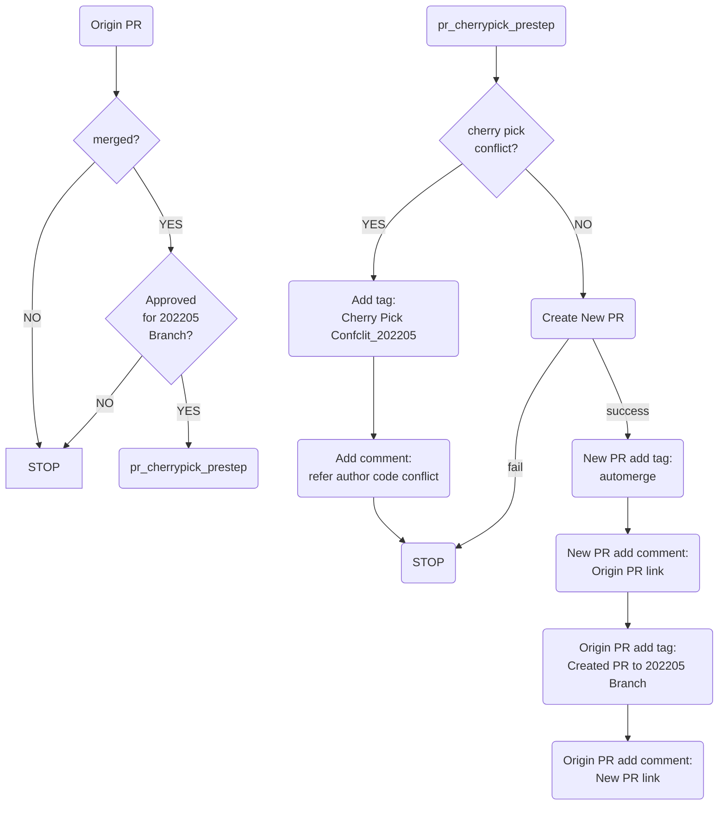
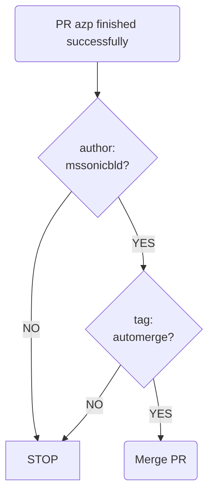
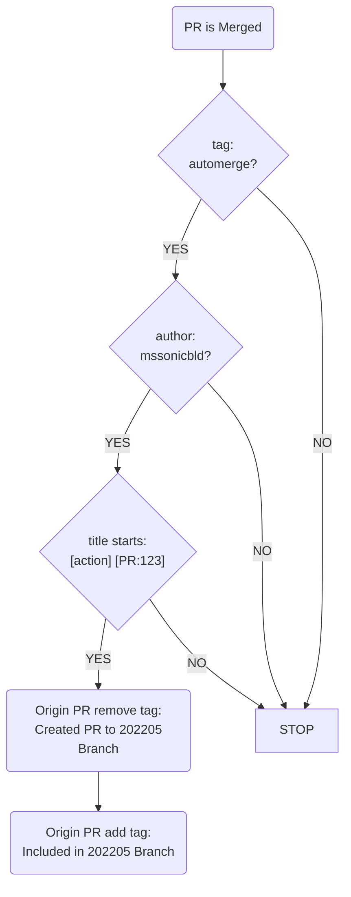

#  Github actions README
This is an introduction about auto-cherry-pick workflow.
take 202205 branch for example:
1. pr_cherrypick_prestep:

```mermaid
graph
Start(Origin PR) --> A{merged?}
A -- NO --> STOP
A -- YES --> A1{Approved<br> for 202205<br> Branch?}
A1 -- NO --> STOP
A1 -- YES --> A2(pr_cherrypick_prestep)
B(pr_cherrypick_prestep)
B --> B1{cherry pick<br>conflict?}
B1 -- YES --> B2(Add tag:<br>Cherry Pick Confclit_202205) --> B3(Add comment:<br>refer author code conflict) --> STOP1(STOP)
B1 -- NO --> B4(Create New PR) -- success --> B5(New PR add tag:<br> automerge) --> B6(New PR add comment:<br>Origin PR link) --> B7(Origin PR add tag:<br>Created PR to 202205 Branch) --> B8(Origin PR add comment:<br>New PR link)
B4 -- fail --> STOP1
```

2. automerge:

```mermaid
graph
Start(PR azp finished successfully) --> A{author:<br>mssonicbld?}
A -- NO --> STOP
A -- YES --> B{tag:<br>automerge?} -- YES --> C(Merge PR)
B -- NO --> STOP
```

3. pr_cherrypick_poststep:

```mermaid
graph
A(PR is Merged) --> B{tag:<br>automerge?}
B -- YES --> B1{author:<br>mssonicbld?}
B1 -- YES --> B2{"title starts:<br>[action] [PR:123]"}
B2 -- YES --> C(Origin PR remove tag:<br> Created PR to 202205 Branch) --> D(Origin PR add tag:<br> Included in 202205 Branch)
B -- NO --> STOP
B1 -- NO --> STOP
B2 -- NO --> STOP
```
